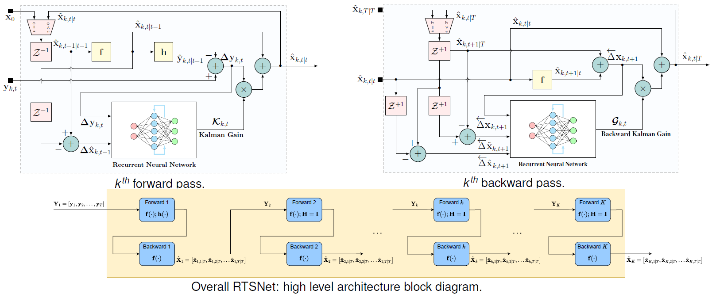

# RTSNet



[RTSNet](https://arxiv.org/abs/2110.04717) extends [KalmanNet](https://arxiv.org/abs/2107.10043) from filtering to smoothing. The inside network structure is also upgraded.

## Running code

* Linear kinematic model

```
python3 main_linear_CA.py
```

* Linear canonical model (include scaling model dim, scalable trajectory length T, random initial state)

```
python3 main_linear_canonical.py
```

* Linear canonical with partial model info

```
python3 main_linear_estF.py

python3 main_linear_estH.py
```

* Non-linear Lorenz Attractor model (discrete-time, decimation and non-linear observation function cases)

```
python3 main_lor_DT.py

python3 main_lor_DT_NLobs.py

python3 main_lor_decimation.py
```

## Parameter settings

* Simulations/model_name/parameters.py

Contain model settings: m, n, f/F, h/H, Q and R. 

* Simulations/config.py

Contain dataset size, training parameters and network settings.

* main files

Set flags, paths, etc.